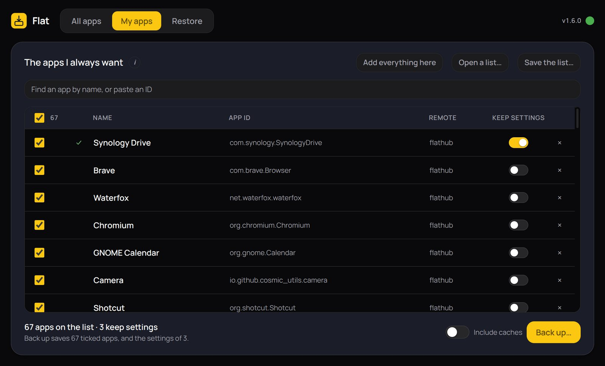

# Flat

Keep a list of the Flatpak apps you always want. On a fresh install, press
one button: every app on the list goes on, and the ones you marked **Keep
settings** come back with their profiles, bookmarks and preferences.

Written to move a desktop from Fedora to Debian without losing browser
profiles, logins, extensions and app settings. Ships as an AppImage so it
runs on a bare new install, before anything else has been set up.



## Three tabs

**All apps** lists every Flatpak app on this machine, with the size of the
settings and data each one keeps. Tick the ones you want — **All** ticks every
one — and press **Add to My apps**. An app already on My apps carries a small
tick.

**My apps** is your list. **Keep settings** starts switched on for every app
that has settings on this machine; switch it off for anything you would
rather have fresh on the next one, and that choice is remembered. An app that
has saved nothing says **No settings** instead. The **Size** column says how much each
app's settings take, anything over 250 MB in amber, and the total at the
bottom says roughly how big the backup comes out, so a heavy one can be left
out on purpose. Everything starts ticked, and the number beside
**All** says how many. Untick anything you want left out and press
**Back up…**: the file carries the ticked apps, and the settings of the ones
switched on. It will not start while any of those is open — Flat names them,
with **Check again** and **Close them for me**, because a profile copied while
its app is running comes out locked or half-written. Caches stay out unless
**Include caches** is on.

**Restore** opens a backup — Flat finds one on its own beside the AppImage, in
the folder it was run from, or in Downloads — and shows the same list. The
switch is already on for every app whose settings are in the file. Untick
anything you do not want and press **Restore**: every app goes on at user
scope, with no password, and then the switched-on ones get their settings
back. An app already on the machine is passed over and never touched,
settings and all. Anything that fails is named on its own row, and the run
carries on to the next app.

## The list

Each row is a name, an app ID like `org.mozilla.firefox`, and a remote
(`flathub` unless you say otherwise). There is no Flathub location to look
up: apps join the list from All apps, or from the search box, which takes a
name or a pasted ID and only offers apps that really exist. The ID and remote
are shown, not typed, so a list cannot hold a misspelt one. The name is only
a label, so it can be changed in place, and it saves itself.

Removing a row with its × is remembered, so **Add everything here** leaves it
out rather than walking it back on. Ticking it on All apps, or adding it by
name, puts it back for good, and **Forget removals** clears the lot. The
removals travel with the saved list, because "never this one" is a decision
about the list rather than about one machine.

Anything the app wants to tell you is said in the line under the tally and
clears itself after a few seconds. Nothing floats over the buttons.

If Flathub is missing entirely — likely on a brand new install — the
Restore tab says so and offers to add it.

## Remotes

Remotes are always made to exist at **user scope** before installing. Most
distributions add Flathub system-wide, which looks present and then fails a
`--user` install with nothing more helpful than "no remote refs found". The
system installation's own trusted signing key is copied across with it, so
signature checking stays on.

When the name is already taken system-wide, the user copy is added as
`flathub-user` rather than a second `flathub`. Two remotes of the same name
make every `flatpak install -y flathub <app>` on the machine stop and ask
which one is meant — including the ones you type yourself. Flat does not get
to change what your own commands mean.

## Getting the order right

Settings are put back in this order and only in this order:

```
remote → install → close app → wipe generated dir → extract → chown → overrides
```

Restoring data before the app is installed means Flatpak recreates the
directory on first install and the copy is gone. Launching the app once first
does the same. Copying without preserving ownership makes the app fall back
to a new profile without saying so. And a different user ID between machines
makes the profile unreadable, so `chown` afterwards is mandatory rather than
tidiness.

Every app's data is checksummed on the way in and verified on the way out,
and nothing in a backup file's manifest reaches `flatpak` or `tar` until it
has been checked.

## Known limits

- **Apps come back at their newest version**, not the one you had, because
  each is installed fresh from Flathub. Settings almost always carry over,
  but now and then a newer version asks you to set something up again. The
  Restore tab says so before you press Restore.

- **Logins may not survive.** Apps that keep their token in the system
  keyring (GNOME Keyring, KWallet) keep it outside Flatpak entirely, so those
  sessions need signing in again. Firefox and Thunderbird profiles are
  self-contained and generally do come back.
- **Everything restores to user scope**, even where it was system-wide
  before. No password is needed and the result is the same on any
  distribution.
- **A much older target distro** may not carry the recorded branch. The
  default branch is installed instead and the app says so.
- **Not for non-Flatpak apps.** Native `.deb` and `.rpm` packages, Snaps and
  AppImages are out of scope.

## The pack format

A `.fmpack` is a plain (uncompressed) tar holding:

```
manifest.json            the app list, what is inside, and how to put it back
overrides/global         the machine's global override file, if any
overrides/app/<app-id>   that app's own override file, if any
apps/<app-id>.tar.zst    that app's ~/.var/app directory
```

The outer tar is deliberately not compressed and the per-app blobs inside it
are. A restore usually wants some of the apps and not all of them, and a
member of a plain tar can be pulled out on its own where a member of a solid
compressed stream cannot. It also gives the manifest something per-app to
checksum. No compression is lost by it — all the bulk still goes through
zstd, one directory at a time. Where `tar --zstd` is unavailable the blobs
fall back to gzip, and the manifest records which was used.

## The tray icon

Flat sits in the system tray while it is open. The menu goes straight
to any tab, and the tooltip shows how far a running job has got.

Closing the window while a backup or restore is running hides it to
the tray and lets the job finish — useful during a sixty-app install you do
not want to sit and watch. With nothing running, closing the window closes the
app. Quit on the tray menu ends it either way, once any running job is done.

## Updating

The small dot beside the version, top right, is the whole update interface.
It checks on startup and every thirty minutes. Green means up to date and a
click checks again; yellow means there is a newer build and a click downloads
it; the ring traces the download; blue means click to restart into it. Red
means it could not reach the update server.

Releases are published on
[GitHub](https://github.com/lightmorphic/flat/releases). Each one carries the
AppImage and the `latest-linux.yml` that electron-builder writes beside it,
which is what the dot reads to decide whether there is a newer version.

## Building

```bash
npm install
npm test          # logic and a real pack round-trip, no Electron needed
npm start         # run it
npm run dist      # build the AppImage and latest-linux.yml
node scripts/make-icons.js   # redraw build/icons/*.png
```

All Flatpak interaction is by shelling out to the `flatpak` CLI; nothing
links against libflatpak, so the AppImage runs anywhere the command exists.
Flat never needs to be installed as a Flatpak itself.

## The name

Flat was called Flatmorphic until 18 September 2026. Backups keep the
`.fmpack` extension so every one already made still opens, a list saved as
`flatmorphic-apps.json` is still found, and the first run as Flat copies the
old settings folder across.

## Licence

GPL-3.0-or-later.
